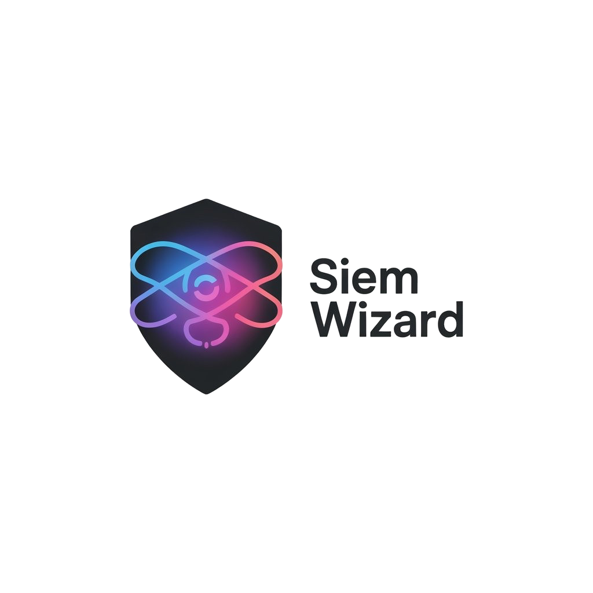

<div align="center">
  

  # SIEM Wizard

  **AI-Powered Security Rule Generator for Multiple SIEM Platforms**

  [](https://opensource.org/licenses/MIT)
  [](https://nodejs.org/)
</div>

---

## Overview

SIEM Wizard is an AI-powered platform for generating, optimizing, and managing security detection rules across multiple SIEM platforms. Transform natural language descriptions into production-ready rules for Splunk, QRadar, LogSign, and Wazuh.

## Features

- **Rule Generator**: Generate SIEM rules from natural language descriptions
- **Rule Catalog**: Browse 30+ pre-built security rules across 10 categories
- **Rule Optimizer**: Get AI-powered optimization suggestions for Wazuh rules
- **Log Analyzer**: Create detection rules from real log samples
- **Analytics Dashboard**: Track usage patterns and rule generation history
- **Multi-language Support**: English, Turkish, Spanish, German, Hindi

## Quick Start

```bash
# Clone and install
git clone https://github.com/parlakbarann/siem-wizard.git
cd siem-wizard
npm install

# Start the server
npm start
```

Visit `http://localhost:3000` and create an account to get started.

## Getting Your API Key

1. Create an account at `http://localhost:3000`
2. Get a free API key from [DeepSeek Platform](https://platform.deepseek.com/)
3. Add your API key in the Settings page

Alternatively, you can create a `.env` file with a shared API key:
```env
DEEPSEEK_API_KEY=your_api_key_here
```

## Tech Stack

- **Frontend**: HTML5, JavaScript, Tailwind CSS
- **Backend**: Node.js, Express
- **Database**: SQLite
- **AI**: DeepSeek API
- **Auth**: JWT, bcrypt

## Security

- Bcrypt password hashing
- AES-256-GCM encryption for API keys
- JWT-based authentication
- SQL injection & XSS protection

## Development

```bash
# Run with auto-reload
npm run dev

# The server runs on port 3000 by default
# Change port: PORT=8080 in .env file
```

## Contributing

Contributions are welcome! Fork the repo, create a feature branch, and submit a pull request.

## License

MIT License - see [LICENSE](LICENSE) file for details.

## Acknowledgments

This project was inspired by [RuleWizard](https://github.com/onuroktay14/rulewizard) by Onur Oktay.

---

Built by Baran Parlak based on Onur Oktay's [RuleWizard](https://github.com/onuroktay14/rulewizard)
